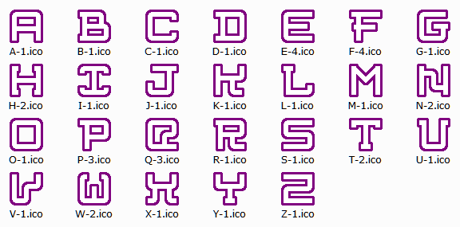

### Alphabet Web Icons

by: Keith Fenske, https://kwfenske.github.io/

Have you ever wondered why program icons are so bland in current versions of
Microsoft Windows? They were much more colorful in the days of Windows XP
(2001). Many icons today are scaled down from a larger size such as 256x256
pixels. That blurs and ruins fancy artwork. Designs must be simpler.

These "alphabet web icons" have a 16x16 or 32x32 grid, expanded to other sizes,
adding rounded corners and an outline. The style is "structural tubing" with an
off-white color inside darker purple, which displays well on most backgrounds
and should look good as defined or resized. You may use the letters, digits,
and symbols as program icons for Microsoft Windows or as
"[favicon.ico](https://en.wikipedia.org/wiki/Favicon)" files on web pages (that
is, bookmark icons).

1. Icons are square, and each icon uses a fixed amount of space, with a small
empty border. No two letters are similar by reflection or rotation. Digits
don't count.

2. Icons are bitmapped from 16x16 pixels to 256x256 pixels. Icons of the same
size have the same general appearance. Sizes are 16, 20, 24, 28, 32, 40, 48,
64, 96, 128, 192, and 256 pixels.

3. Desktop web browsers need a 32x32 icon, should have a 16x16 icon, and might
use other sizes. Google Chrome (about 70% of the desktop market) resizes 32x32
to whatever it wants, and ignores other sizes.

4. Mobile web browsers use dozens of sizes that are always changing. There is
no support for mobile browsers unless they accidentally request a size listed
above.

"IconTwo" is a second version of "IconWeb" and makes the following changes:

5. Files are named with Unicode character numbers in hexadecimal. For example,
the uppercase letter "N" is U+004E and "004E" is part of the file name, because
not all characters are suitable in file names. Finding a particular character
can be difficult without the index. See also any
"[Character Map](https://github.com/kwfenske/character-map-java)" application.

6. Letters are less ornate. Rounding on 90-degree elbows has been improved. The
fill color is now very light cyan instead of white, using a custom palette.

7. Diagonals don't scale the same as perpendicular lines when Windows resizes
icons. You can see this in the index, despite best efforts. Some icons have
both tubular forms and diagonal alternates. Some are done with geometric shapes
and pixel coordinates.

Download the ZIP file here: https://kwfenske.github.io/alphabet-web-icons.zip

Released under the terms and conditions of the Apache License (version 2.0 or
later) and/or the GNU General Public License (GPL, version 2 or later).
